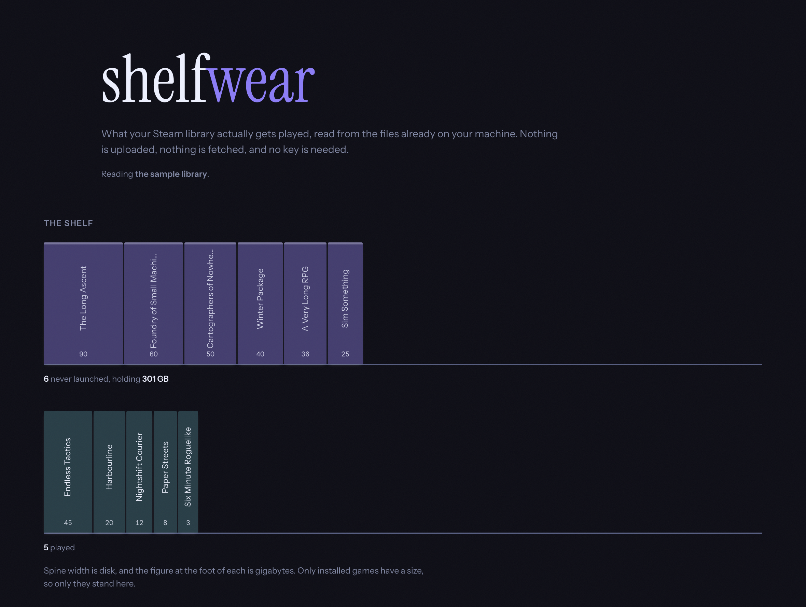

# shelfwear

What your Steam library actually gets played, read from the files already on your machine.



Drop in `localconfig.vdf` and your `appmanifest_*.acf` files. Nothing is uploaded, nothing
is fetched, and no API key is involved, because everything it needs is already on disk.

*Shelfwear* is the trade term for the damage stock takes from sitting unsold. It seemed
like the right word.

## What it tells you

- How many titles this client has a record of, and how many have **never been launched**.
- **How much disk the unplayed ones are holding.** This is the number that stings.
- How few titles make up half of all the hours you have spent. It is usually a much
  smaller number than people expect.

## Limitations

`localconfig.vdf` only lists apps this Steam client has a local record of. That is not
your library. Anything you own but have never launched on this machine leaves no local
trace at all, so **every count here is a floor, not a total** - and the page says so
rather than presenting a confident number it has no basis for.

A game with no manifest is still a row: playtime with no install is a game you played and
then removed, which is a fact worth keeping. Its size shows as *not installed*, which is
not the same as zero, and it is not counted in the disk totals.

If an installed game's manifest carries no `SizeOnDisk`, the byte figures say they are a
floor and give the count of games missing from them.

## The files

| | |
| --- | --- |
| `userdata/<id>/config/localconfig.vdf` | hours and last-played, per app |
| `steamapps/appmanifest_<id>.acf` | one per installed game: its name and size |

Either alone works, with less to show. Together you get names against hours.

## Reading Valve's format

Everything in a Steam install is KeyValues text. `src/lib/vdf.ts` is a parser for it,
written against the shape the files actually have, because there is no specification.

Two things in there are the difference between working and appearing to work:

- **Key case is not consistent.** The same client writes `apps` and `Apps`, `Steam` and
  `steam`. A case-sensitive lookup works on one machine and returns nothing on the next,
  and nothing renders as an empty library, which looks exactly like a true answer.
- **`\s` is not an escape.** Windows paths are full of sequences that are not escapes, and
  a parser that swallows the backslash corrupts every path in the file while still
  parsing cleanly.

An unterminated string or an unclosed block throws with a line number rather than
returning the half of the file it managed to read. Half a library is a small library, and
a small library is a believable lie.

## Run it

```bash
npm install
npm run dev
```

`npm test` is the parser and the arithmetic; `npm run e2e` drives a real browser against
Steam-shaped fixtures, tabs and inconsistent capitalisation included.

The page opens on a sample library so there is something to look at before you have given
it anything, and it says it is a sample.

## Licence

MIT.
