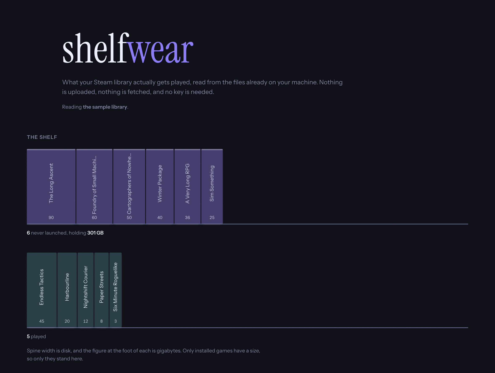

# shelfwear

A view of your Steam library based on what you actually play. You can keep it local, or load a public profile when you want something easy to share.



## Two ways in

### Local files — most private

Drop in `localconfig.vdf` and your `appmanifest_*.acf` files. They are parsed in the browser and are not uploaded. This mode can show local install size and disk held by games you have never launched.

### Public Steam profile — easiest to share

On a Cloudflare Workers deployment, paste a public Steam profile URL or 64-bit SteamID. The Worker keeps the Steam Web API key server-side and asks Steam only for public owned-game/playtime data plus the public profile summary used for the display name/avatar. If Game details are private, Steam will not return the library.

The interface uses original inline SVG doodles, emoji/kaomoji accents, and system fonts. It does not hotlink a character pack or third-party webfont.

The main Shelf view also has a sticky **Shelf map**: a compact, horizontally scrollable catalog strip for jumping to the sections that actually exist for the current data source. On phones, the four top-level views use a 2×2 switch instead of a tall four-row stack.

For sharing, Shelfwear can make:

- **Your nine** — the nine titles with the most recorded playtime, in a 3×3 grid.
- **Shelf Stories** — prompt-driven, hand-picked collections such as Games that shaped me, comfort games, and multiplayer memories.
- **My shelves** — browser-local personal collections such as comfort games, currently playing, childhood favorites, backlog, multiplayer, or a custom shelf. Games can be filed from the Shelf Index, reordered, annotated, and handed off into Shelf Stories.
- **Pick something** — a transparent random draw from an explicit pool: never played, under 2h played, real local installs, or the currently loaded games on a custom shelf. Shelfwear shows the exact eligibility rule, supports draw-again and session-only exclusions, and never presents the result as a taste recommendation.
- **Library export** — download the currently loaded library as CSV or JSON with explicit provenance. Public-Steam exports contain owned-game/playtime fields only; real local-file exports may additionally contain install state, known disk bytes, and local last-played timestamps. The bundled sample is labeled synthetic demo data.\n- **Share a personal shelf list** — My Shelves can send or copy the ordered game names as plain text without including private shelf notes. This provides a lightweight Discord/message path without pretending browser-local shelves have a public URL.\n- **Random Shelf Index result** — open one random catalog card from the current Shelf Index search/filter pool. The exact current result count remains visible, and the action is a literal random draw rather than a recommendation or taste score.
- **Shelf receipt** — a downloadable 1080×1350 receipt-style artifact made from current observable values: represented games, total recorded hours, untouched titles, top recorded-hour games, and biggest known installs only when real local files provide them.
- **Achievement Cabinet** — public-Steam-only, on-demand achievement details for one selected game, including completion, rarest unlocked achievement when Steam provides global percentages, latest recorded unlock, and a selectable 1080×1350 Trophy Cabinet card.
- **Download card** — a 1080×1350 PNG rendered in the current Shelfwear palette. Local/sample mode is fully browser-only; Steam mode asks Shelfwear's same-origin Worker cover endpoint for public artwork and falls back to typographic tiles when artwork is unavailable.
- **Shelf familiar** — a deterministic mascot based only on observable library patterns, presented as a cataloged library specimen with three visible evidence fields, a field note explaining why it was chosen, and its own downloadable 1080×1350 bookplate card. It describes the library shape, not the person.
- **Copy summary** — a text version of the nine for sharing anywhere.
- **Share shelf** — a stateless URL containing only the resolved public SteamID. Shelfwear opens the browser/OS share sheet when Web Share is available and otherwise copies the URL; opening it prefills the profile so Shelfwear can rebuild the result live. No library snapshot is stored.
- **Compare two shelves** — ownership overlap, each shelf’s unique corner, games with recorded playtime on both profiles, “easy handoffs” where only one profile has recorded time in a jointly owned game, a shared-shelf signature, and a downloadable 1080×1350 friend comparison card. If a public shelf is already loaded, Shelfwear places it into the first open comparison slot without replacing anything already entered. Sharing uses the native share sheet when available with a clipboard fallback; links contain only the two public SteamIDs.
- **Party Shelf** — put 3–5 public Steam shelves on one table, see literal all-owned/all-played counts, handoff games, almost-shared games, and draw tonight’s title only from games everyone owns. A currently loaded public shelf is placed into the first open party slot instead of asking for it again. Party links use the same native-share-first, clipboard-fallback behavior.
- **Invite a friend** — after loading your own public shelf, copy either a one-sided invite URL or a ready-to-send invite message. The URL contains only your resolved public SteamID. The recipient lands on a ruled-paper Shelf Invite, sees the three-step handoff, and adds only their own public Steam profile.

## What it tells you

- **The shelf.** Installed games become spines sized by disk use; never-launched games stand apart.
- How many titles are represented and how many have **never been launched**.
- **How much disk the unplayed ones are holding** when local manifests provide size data.
- How few titles make up half of all recorded hours.
- For two public profiles, **library overlap** is the intersection divided by the combined unique library; **played by both** only counts shared games where both profiles have recorded playtime. The comparison's strongest shared play signal is the common game with the highest smaller-of-the-two playtime, so one person's huge hours cannot dominate the ordering by itself.

## Data boundaries

Local files and a public Steam profile expose different data, so Shelfwear keeps the two modes separate instead of filling the gaps with guesses.

`localconfig.vdf` only lists apps this Steam client has a local record of. Anything never seen by that client leaves no trace, so local counts are floors rather than account totals.

Public-profile mode uses Steam's `GetOwnedGames` response. It can be broader than the local files, but only when the profile's Game details are visible. It does not provide local disk usage or last-played timestamps. The Worker also uses `GetPlayerSummaries` for public display metadata. Library/profile API responses use `Cache-Control: no-store`, and Shelfwear does not persist imported libraries in KV, D1, or another database.

The `/api/steam/cover/:appid` route is different: it is a tightly scoped proxy for public Steam artwork, accepts only a numeric app ID, and may be cached because it contains no user-specific library data. It exists so exported canvas cards remain origin-clean instead of depending on third-party CORS behavior.

Achievement Cabinet is deliberately **on demand**. Shelfwear does not crawl every game's achievements during library import. For a selected public-Steam game, the Worker combines Steam's player-achievement response with the game's achievement schema and global achievement percentages when those endpoints provide them. The Steam Web API key remains server-side, the response uses `Cache-Control: no-store`, and Shelfwear does not persist the achievement payload in browser storage or a server database.

**Recently played** is a separate on-demand public-Steam request using Steam's dedicated recent-games endpoint. Shelfwear does not call it during ordinary library import. The response is `no-store` and keeps the API key server-side. Shelfwear shows the recent games, lifetime minutes, and the optional two-week playtime Steam returns; it does not reinterpret that list as local install state or invent a last-launch timestamp.

**Shelf History** is different because it is intentionally persistent, but only after the visitor opts in for a resolved public SteamID. Its records stay in that browser's `localStorage`; the Worker never receives or stores them. Each saved state contains the SteamID, snapshot/check times, aggregate counts, and compact `[AppID, lifetime minutes]` pairs. Names, artwork, disk data, install state, local recency, and full API responses are not copied into history.

## Recently played

For a loaded **public Steam profile**, Shelfwear can explicitly load a **Recently played** ledger. It is separate from the owned-games import and separate from the local-file **Recently played on this PC** sort. The ledger uses Steam's recent-games response and shows lifetime playtime plus **last two weeks** playtime only when Steam includes that field for a game.

This feature is deliberately on demand. Opening a public shelf does not automatically make the extra recent-activity request, and local-file/sample mode does not expose the control. Shelfwear never manufactures a calendar timestamp from this endpoint.

## Shelf History

For a loaded **public Steam profile**, Shelfwear can opt into **Shelf History on this browser**. The first click saves a baseline; nothing before that baseline is inferred or reconstructed. On later loads of the same resolved SteamID, Shelfwear compares the newly fetched owned-games state against the last saved state and can report:

- change in recorded lifetime hours and library count,
- games newly visible on the saved shelf,
- games that now have recorded playtime,
- literal crossings of **2h**, **10h**, **50h**, and **100h** for titles already present in the previous saved state.

A newly seen game is never backfilled with historical milestones because Shelfwear did not observe its earlier state. Snapshot timestamps mean only **“Shelfwear saw this library state then.”** They are not play-session timestamps.

History is bounded to **8 saved states** per SteamID while preserving the original opt-in baseline and the most recent changed states. Re-loading an unchanged library updates the local last-check time without adding a duplicate snapshot. Once there are multiple real observations, Shelfwear shows a **Since history began** net-change summary and a small recorded-hours sparkline whose dots are saved observations only; connecting lines do not reconstruct when play happened. Older records whose original baseline had already rolled off are labeled from the **earliest retained state** instead. **Clear local history** removes that SteamID's history record from the browser.

When an already-saved game crosses a **2h**, **10h**, **50h**, or **100h** threshold between two snapshots, that observed crossing can export a 1080×1350 **Milestone Slip**. The card includes the previous and current saved totals plus both snapshot dates. It explicitly says that Shelfwear observed the crossing **between** saved states and does not know the exact moment it happened. Newly seen games do not receive backfilled milestone slips because their earlier state was never observed.

## Whole-shelf browsing

The **Everything** section is interactive rather than a fixed dump of games. Visitors can search by title, sort by most/least played or alphabetically, and filter to **Played**, **Never played**, **100h+**, or **Under 2h played**. Games opened in the Shelf Index can also be filed directly into a browser-local custom shelf. The current Shelf Index result set can also be turned into a new browser-local shelf in one step. Shelfwear preserves the current result order and files at most the first 50 matching games, matching the normal custom-shelf limit. The under-two-hours slice requires recorded playtime greater than zero, so never-played games stay a separate factual category. Every row can also open a small **Shelf Index** record showing only what the current source actually knows: recorded playtime and play state everywhere; install state, known size, and last recorded launch only for real local-file imports. Public Steam records may show the same official artwork already available from the public import, while local-file records intentionally do not fetch artwork automatically. Only real local-file mode enables **Recently played on this PC**, **Largest installed**, and **Installed on this PC**. Public Steam imports never show those controls, and the built-in sample keeps its synthetic local data clearly marked as demo data instead of presenting it as a device fact. The list can switch between cozy and compact row density without changing the underlying data. Shelfwear remembers the selected row density and last sort choice in browser `localStorage`; search/filter state, open catalog records, and Steam library contents are not persisted server-side for these preferences.\n\nFor large libraries, the Shelf Index renders the first 100 matching rows and exposes a factual **Show more** control in 100-row batches. Search, sort, and filter changes reset the visible window to the first batch. This only limits DOM rendering; the full loaded library still powers counts, analytics, exports, comparisons, Pick Something, and other calculations.\n\nWhile the main Shelf view is open, pressing **/** from outside another editable control jumps focus to **Find a game**. The search field has an explicit clear button, and **Escape** clears an active search first or closes an open Shelf Index record when search is not being edited. The shortcut never steals `/` while the visitor is typing in another input. When search, a factual filter, or a non-default sort is active, Shelfwear shows a compact **Current view** strip with those choices and a single **Reset view** action. Resetting returns search/filter/sort to the default view without changing the visitor's chosen cozy/compact row density. Open Shelf Index records are also browseable in the exact current result order: the card shows its position, provides previous/next controls, and accepts **K/J** for previous/next when focus is not inside an editable control. Changing search/filter state closes an open record if that game no longer belongs to the current result set. The active row is visually marked, and opening or browsing a record brings the catalog card into view without persisting the selection.

## My shelves

**My shelves** is the local curation layer between browsing and sharing. A visitor can create up to 12 named shelves, start from lightweight presets such as **Comfort games**, **Currently playing**, **Childhood favorites**, **Backlog**, or **Multiplayer**, add games from the loaded library or directly from a Shelf Index record, reorder them, and attach short private notes. Once there are four or more shelves, a **Jump to shelf** switcher complements the horizontal shelf tabs; changing the active shelf also keeps its tab scrolled into view. Shelves with at least two games also expose **Bulk edit**: native checkboxes select explicit entries, and the selected games can move to the top or bottom as a stable block or be removed together after confirmation. Bulk selection is session-only UI state; it does not add any new persisted data. Bulk edit can also copy or move the selected entries to another shelf. Transfers append in the source shelf's order, preserve each transferred entry's private note/icon metadata, skip AppIDs already present on the destination, and stop at the destination's 50-game limit. A move removes only entries that were actually inserted, so duplicates or capacity-blocked games stay on the source shelf. Reorder, removal, copy, and move actions expose a one-step in-session **Undo** that restores the exact pre-action shelves and selection.

Custom shelves live under `shelfwear:custom-shelves:v1` in that browser's `localStorage`. Shelfwear stores only the custom shelf IDs/names, selected game AppIDs/names, optional public icon hashes, order, timestamps, and notes. It does **not** persist the imported library's playtime, disk-size, install, or recency dataset with the shelf. This remains true when a shelf is made from Shelf Index results: the search/filter chooses which games are filed, but source metrics are not copied into the saved shelf. A shelf can stay local or send its first nine games, in order, into Shelf Stories; those shelf notes become editable Story notes.\n\nMy Shelves also supports a portable JSON backup. The backup uses a versioned `shelfwear.custom-shelves.v1` schema and contains only the same compact curation data already stored in `localStorage`; it deliberately excludes playtime, install state, disk size, local recency, and the imported library. Restoring a backup validates and normalizes every shelf/game using the same limits as normal local storage, then explicitly replaces the shelves stored in that browser.\n\nShelf management is intentionally reversible-looking rather than destructive-by-default: a shelf can be duplicated with its order and notes intact, while deleting a shelf requires an explicit confirmation that explains the Steam library itself is unaffected. Duplicate names use a bounded `copy`, `copy 2`, etc. suffix so experiments remain distinguishable without breaking the 40-character shelf-name limit.

## Party Shelf

**Party Shelf** compares **3–5 public Steam profiles** at once using the same live public-library import already used by two-person comparisons. It reports the combined unique library, games owned by everyone, games with recorded playtime on every profile, each shelf's unique-game count, games owned by a majority of the group, and factual handoffs where everyone owns a game but only some profiles have recorded playtime.

The **Tonight's draw** is intentionally transparent: its pool is only the games owned by every profile in the Party Shelf. Drawing again just cycles through that visible eligible pool; it is not a recommendation score and it does not infer taste or compatibility.

Party links are stateless. A `?party=...` URL contains only **3–5 unique resolved public SteamIDs** and rebuilds every public library live when opened. No group library snapshot, playtime payload, draw result, or person-level inference is stored in the URL.

## Achievement Cabinet

For a loaded **public Steam profile**, opening a game's Shelf Index exposes an optional **Achievement Cabinet**. Nothing is fetched until the visitor presses **Load achievements** for that game. The cabinet shows the literal unlocked/total count and completion percentage returned from the combined Steam responses, the rarest unlocked achievement only when a global percentage is available, and the latest recorded unlock only when Steam provides a non-zero unlock timestamp.

Unlocked achievements can be pinned (up to six) into a 1080×1350 **Trophy Cabinet** artifact. The share card uses achievement names, descriptions, rarity percentages, and unlock dates already returned for that selected game; it does not infer difficulty, skill, prestige, or player personality. Local-file and sample modes do not expose this control because those sources do not contain account achievement data.

## Library export

The **Everything** header includes **Export CSV** and **Export JSON** for the currently loaded library. Exports are source-aware rather than normalized into a misleading universal schema:

- public Steam: AppID, name, lifetime minutes, public icon hash when available, and public-Steam provenance
- real local files: AppID, name, lifetime minutes, install state on this PC, known disk bytes, and local last-played Unix timestamp
- bundled sample: the same demo-shaped fields, explicitly labeled `synthetic_demo`

Public exports deliberately omit install, disk, and local-last-played columns instead of filling them with zeroes or inferred values. The export is generated in the browser from the data already loaded into Shelfwear.

## Shelf receipt

**Shelf receipt** turns the current loaded shelf into a compact 1080×1350 takeaway slip. It uses only values Shelfwear can currently observe: represented game count, total lifetime minutes, untouched count, and the top games by recorded hours.

When the source is a **real local-file import**, the receipt may also show the biggest installed games whose disk sizes are actually known from appmanifest files. Public Steam receipts never show or infer local install size, install state, or local recency. The bundled sample is stamped **synthetic demo data** rather than presented as device evidence.

The date printed on a receipt is the artifact generation date. It is not a play-session timestamp or a historical observation claim.

## Pick something

**Pick something** is a deliberately simple chooser rather than a recommendation engine. The visitor chooses the drawer, Shelfwear counts the games that literally qualify, and the draw is random inside that pool. Every result keeps the rule visible, for example: “Drawn from 14 games with 0h recorded.”

The available drawers are **Never played**, **Under 2h played**, **Installed on this PC** only after real local files are loaded, and a selected browser-local custom shelf intersected with the currently loaded library. “Exclude this game for this session” changes only the in-memory draw pool; it is not persisted and does not alter the shelf. No taste score, personality signal, compatibility score, or hidden ranking is involved.

## Shelf Stories

**Shelf Stories** turns the hand-picked card builder into a small prompt-driven collection maker. Start from **Games that shaped me**, **My comfort games**, **Currently obsessed**, **Childhood favorites**, **Multiplayer memories**, or **Play again for the first time**. Choosing a prompt sets a suggested title and caption without replacing games you already picked. You can then add titles manually or pull them from the loaded shelf, attach a Steam AppID or Store URL when you want official artwork, order up to nine games, and add a short optional **why this one?** note to each pick.

Stories also have three visual treatments: **Scrapbook**, **Polaroid**, and **Poster**. Scrapbook is the canonical Shelfwear story artifact: a ruled-paper folio with a shelf spine and hand-picked catalog framing. A separate **Finishing touch** control lets the author keep the full **Archive** treatment, switch to **Doodles** for hearts/sparkles and looser scraps, or use **Clean** for a quieter version of the same Shelfwear structure. Polaroid and Poster remain alternate card looks. These choices change both the live preview and exported card; they never change or invent game data.

Sharing stays stateless. New share URLs use `?story=...` and contain only the story title, caption, selected card look, selected finishing touch, selected game names, optional per-game notes, numeric Steam AppIDs, and public Steam icon hashes when a loaded library provides them. Shelfwear does not create an account or store the story. Existing `?top=...` links remain supported and open the same editable Shelf Stories view.

The builder can export a 1080×1350 PNG carrying the selected card look and authored notes. Games with an AppID use the existing same-origin Steam artwork proxy. If Steam has no portrait, Shelfwear prefers the public icon hash from GetOwnedGames and otherwise letterboxes an official wide Steam asset rather than cropping it into a blurry square. Games without an AppID intentionally use a designed text tile rather than guessed artwork.

## Shelf Familiar

Shelf Familiar is the companion artifact to Shelf Stories and friend comparisons. The on-page result is styled as a **library specimen/bookplate** with a classification label, numbered evidence fields, a field note, and a catalog stamp. The 1080×1350 export uses the same structure rather than a generic mascot card.

The familiar remains deterministic and evidence-first: its name, glyph, description, signals, and evidence come from observable library-shape logic already shown in the interface. The card explicitly states that it is cataloged from library patterns only and is not a personality test or a claim about the person.

## Friend comparison cards

After loading two public profiles, Shelfwear can export a 1080×1350 **library-card-style** comparison artifact with a ruled-paper field, shelf labels for both profiles, a stamped overlap mark, checkout-slip rows for up to six mutually played games, a stamped shared-shelf signature, and an optional handoff note when one side has played a jointly owned game and the other has 0h recorded. It still carries the same display names, library overlap, shared ownership count, played-by-both count, each shelf's unique-game count, and recorded hours. Shared games reuse Shelfwear's same-origin Steam artwork proxy and official icon fallback.

The on-page comparison also shows **easy handoffs**: games owned by both profiles where exactly one side has recorded playtime. They are ordered by the recorded playtime on the side that has played them. This is only a visibility shortcut for shared ownership/playtime, not a recommendation score.

The comparison card does **not** create a compatibility score or infer anything about the people. Its figures are the same observable public-library measures already shown on the comparison page. The existing share-comparison URL remains stateless and contains only the two resolved public SteamIDs.

Friend invites are stateless too. An invite uses `?invite=<SteamID>#compare` and contains only the inviter's resolved 17-digit public SteamID. It does not contain either library, profile name, playtime, comparison result, or the eventual recipient. When the recipient submits their own public profile, Shelfwear fetches both public libraries live and creates the normal comparison.

## Analytics

Shelfwear has a second, page-like Analytics view derived only from the currently loaded library. Its presentation now uses the same physical artifact system as the social surfaces: a **Reading Room** ledger with ruled sheets, catalog codes, numbered slips, shelf-depth bars, and a simple hour ledger instead of generic dashboard cards. It still reports only observable measures such as library utilization, untouched share, playtime-depth buckets, top-game concentration, and the games carrying the largest share of recorded hours. Local-file mode can additionally show known disk-space and last-played buckets when those fields exist. Public Steam imports do not invent disk or recency data that Steam does not return.

The GitHub Pages build sends public-Steam API and cover requests to the production Worker at `https://shelfwear.rlawoals0529.workers.dev`. The Worker allows that specific Pages origin with CORS; local-file parsing still stays entirely in-browser. Merges to `main` automatically deploy the current build to Cloudflare so the Worker and frontend do not drift.

## Cloudflare Workers deployment

The repository includes `worker/index.ts` and `wrangler.jsonc`. Static Vite output is served by the Worker and `/api/*` runs through the Worker first.

### GitHub Actions — recommended

`.github/workflows/cloudflare.yml` provides a manual production deployment so credentials stay in GitHub Actions secrets instead of the repository.

Configure these repository secrets under **Settings → Secrets and variables → Actions**:

- `CLOUDFLARE_API_TOKEN` — a Cloudflare API token permitted to deploy this Worker.
- `CLOUDFLARE_ACCOUNT_ID` — the target Cloudflare account ID.
- `STEAM_WEB_API_KEY` — the Steam Web API key bound to the Worker as a secret.

Then open **Actions → Cloudflare deploy → Run workflow**. The workflow runs `npm ci`, builds the Vite assets, deploys with Wrangler, writes `STEAM_WEB_API_KEY` as a Worker secret, and records the returned deployment URL in the job summary. Do not commit any of these values.

### Local deployment

Build the app:

```bash
npm install
npm run build
```

Configure the Steam API key as a Worker secret rather than committing it:

```bash
npx wrangler secret put STEAM_WEB_API_KEY
```

Then deploy:

```bash
npx wrangler deploy
```

The checked-in Wrangler config uses the current Workers Static Assets model. GitHub Pages can remain in place until the Worker deployment has been verified; on Pages, local/sample mode and PNG export still work, while Worker-backed Steam actions explain that a Cloudflare deployment is required.

## The files

| | |
| --- | --- |
| `userdata/<id>/config/localconfig.vdf` | hours and last-played, per app |
| `steamapps/appmanifest_<id>.acf` | one per installed game: its name and size |

Either alone works, with less to show. Together you get names against hours.

## Reading Valve's format

Everything in a Steam install is KeyValues text. `src/lib/vdf.ts` is a parser for the shape the files actually have.

Two details matter:

- **Key case is not consistent.** The same client can write `apps` and `Apps`, `Steam` and `steam`.
- **`\s` is not an escape.** Windows paths contain backslash sequences that must survive parsing.

Malformed input fails rather than quietly producing a believable partial library.

## Run it

```bash
npm install
npm run dev
```

`npm test` covers parser/arithmetic/social-summary/share-link/comparison/export helpers; `npm run e2e` drives a browser against Steam-shaped fixtures and verifies the generated share card is a real 1080×1350 PNG.

The page opens on clearly labeled synthetic sample data so there is something to inspect before loading a library.

## Licence

MIT.
